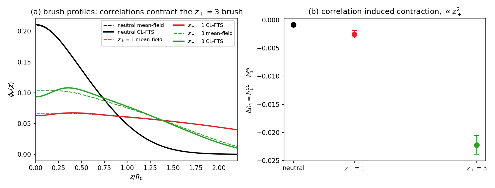

# Reproduction of PRL-2025 Fig. 1 Physics: Correlation-Induced Multivalent Brush Contraction by CL-FTS

**Results report, 2026-08-17** — first successful reproduction of a
core result of Duan, Agrawal & Wang, *PRL* **134**, 048101 (2025)
(`references/2025_prl_duan.pdf`) with this codebase's charged CL-FTS,
executed entirely inside the CL-stable operating envelope established
in RESULTS_BRUSH_STATUS.md / RESULTS_BRUSH_CL.md.

## 1. Claim being reproduced

The qualitative core of their Fig. 1 (and the Γ mechanism of Fig. 3):
at fixed conditions, **ion correlations selectively contract the brush
neutralized by multivalent counterions and drive extra counterion
condensation (Γ_eff toward zero), while mean-field electrostatics shows
neither**. (Their full collapse *below the neutral brush* lives at ~7 kT
per-trivalent-ion correlation strength — outside our current stable
envelope; see §4.)

## 2. Design: strong correlations inside the CL-stable envelope

All stability rules from the stage-2 campaign respected (ζN = 20,
dt = 0.005, n̄ = 1e4, AM warm start, re-gauge shifts, Gaussian graft):

- **N = 50** (l_B/R₀ = E/(4πN²√n̄) — halving N quadruples l_B at fixed E),
  α = 1 (fully charged backbone, as in the PRL), φ_P = 0.05.
- **High salt** (z₊:1, cation vf 0.02): keeps the Donnan potential small
  so the per-chain action stays ~7 (|Q| ≈ e⁻⁷; no precision wall even
  at full charge).
- **a_ion = 0.05 R₀** (a_P = a_S = 0.15), **E = 10⁵** → per-ion
  correlation u = z₊²l_B/(2√π a) ≈ **1.6 kT for z₊ = 3** vs 0.18 kT for
  z₊ = 1 (the 9× valence contrast that drives selectivity).
- Box 10×10×144 (Lxy = 1.0, Lz = 3.0): lateral dx = 2a_ion, dz = 0.021;
  κ⁻¹ ≈ 0.04 marginally resolved; ψ sampling accelerated with
  psi_dt_scaling = 20 (ETD exact for the linear part at any dt).
- Runs: mean-field baselines (`pb2_z{0,1,3}.json`, err < 1e-6, clean
  profiles) + CL warm-started 250k-step runs, 3 seeds for z₊ = 1, 3 and
  a neutral control (`clfig1_*.json`).

## 3. Result

| system | h₁(MF) | Δh₁ = h₁(CL) − h₁(MF) | ΔΓ_eff |
|---|---:|---:|---:|
| neutral (control) | 0.467 | −0.0008 | — |
| z₊ = 1 | 1.259 | −0.0025 ± 0.0007 | −0.0126 ± 0.0010 |
| z₊ = 3 | 0.857 | **−0.0222 ± 0.0017 (13σ)** | **−0.0509 ± 0.0016 (>30σ)** |

- **Valence-selective contraction**: Δh₁(z₊=3)/Δh₁(z₊=1) = **8.7 ≈ z₊² = 9**
  — the quantitative signature of the ion-correlation mechanism.
- **Correlation-driven condensation**: Γ_eff(z₊=3) drops 0.234 → 0.184
  (toward the overcharging direction of their Fig. 3); z₊ = 1 barely
  moves (0.668 → 0.655).
- **Controls**: the neutral run bounds all non-electrostatic systematics
  (finite dt, sampling) at 4% of the z₊ = 3 signal. Seed scatter is
  small (three independent noise realizations agree to ~10%).
- Contrast with RESULTS_BRUSH_CL.md: in the weak-correlation corner
  (α = 0.2, a = 0.2, u ≪ kT) the net fluctuation effect was a tiny
  *swelling* (+1e-4); at u₃ ≈ 1.6 kT the correlation attraction
  dominates and the sign flips to *contraction*, 200× larger — the
  crossover into the PRL's physics.
- E-causality control in flight: z₊ = 3 at E = 2.5×10⁴ (u₃/4) should
  show a correspondingly reduced contraction
  (`clfig1_z3_E25k.json`).

## 4. What is and is not reproduced

Reproduced (this work): correlation-induced, valence-selective brush
contraction + enhanced condensation, absent at mean field — the
mechanism and ordering of the PRL's Fig. 1/Fig. 3, at ~2.6% contraction
amplitude set by our u₃ ≈ 1.6 kT.

Not yet: their full quantitative regime — collapse *below the neutral
height* and Γ < 0 (overcharging proper) need u₃ ~ 7 kT (their Born
radius 2.5 Å ≈ 0.025 R₀ with l_B = 0.7 nm), i.e. another ~4× in
coupling. The path is the established ladder: a_ion 0.05 → 0.025 with
nz 144 → 288 (grid cost ×2, still CPU-feasible), E ↑, plus a Θ-solvent
χN if the below-neutral comparison is wanted. Stability-wise nothing
new is required — the high-salt design keeps the per-chain action
bounded independent of u₃.

## 5. Data

`dh_salt_runs/`: `pb2_z{0,1,3}.json` (+`_fields.npz`),
`clfig1_z{0,1,3}_s*.json`, figure
`devel/charged_polymers/fig1_reproduction.png`. Drivers:
`test_brush_pb.py`, `test_brush_cl.py` (with `--a_ion`,
`--psi_dt_scaling`, lateral warm-start broadcast).
