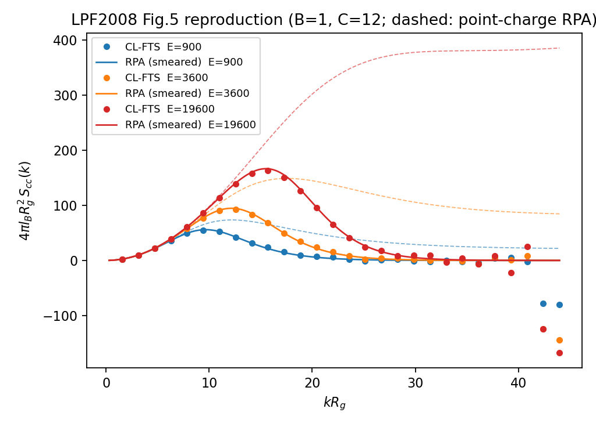

# Reproduction of Lee–Popov–Fredrickson (2008): Polyelectrolyte Complexation by CL-FTS

**Reference**: J. Lee, Y. O. Popov, G. H. Fredrickson, *J. Chem. Phys.* **128**, 224908 (2008)
— "Complex coacervation: A field theoretic simulation study of polyelectrolyte complexation" (LPF2008).

**Date**: 2026-08-02. **Code**: `devel/charged_polymers/clfts_charged.py` (`ChargedCLFTS`).

## 1. Purpose

LPF2008 is the founding CL-FTS study of complex coacervation: a symmetric
polycation/polyanion solution in a good implicit solvent demixes into a dense
polymer-rich coacervate coexisting with a nearly pure supernatant, driven
**entirely by charge correlations** — mean-field SCFT predicts a homogeneous
phase at *all* couplings for this symmetric model (their Sec. III.B).
Reproducing (i) their charge structure factor $S_{cc}(k)$ (their Fig. 5) and
(ii) the fluctuation-induced coacervation transition (their Figs. 4, 6) is
therefore a stringent end-to-end test of the fluctuating-$\psi$ sector of
`ChargedCLFTS`: any error in the electrostatic coupling, the ETD $\psi$
integrator, or the CL sampling would destroy both.

## 2. Model mapping

LPF2008 use discrete Gaussian chains ($N$ beads, every bead carrying charge
$\pm 1$), an Edwards excluded-volume term $\tfrac{u_0}{2}\rho^2$, and point
charges, with dimensionless parameters

$$B = \frac{u_0 N^2}{R_g^3}, \qquad C = \frac{n N R_g^3}{V}, \qquad E = \frac{4\pi l_B N^2}{R_g},$$

and lengths in units of $R_g = b\sqrt{N/6}$. Our conventions (lengths in
$R_0 = b\sqrt{N}$, Helfand compressibility $\zeta N (\sum\phi - 1)^2$, smeared
charges $\hat h = e^{-a^2k^2/2}$) map exactly onto theirs in the canonical
ensemble:

| LPF2008 | This code |
|---|---|
| $B$, $C$ | $\zeta N = B\,C$ |
| $E$ | $E_\text{code} = 6\,C\,E$ |
| $C$ | $\bar n = 216\,C^2$ |
| $L/R_g$ | $L_x/R_0 = (L/R_g)/\sqrt 6$ |
| $N$ beads | discrete chain, $ds = 1/N$ |
| good solvent | $\chi N = 0$ |
| point charges | smearing $a \to 0$ (see Sec. 5) |

The Edwards $\tfrac{u_0}{2}\rho^2$ and Helfand $\tfrac{\zeta N}{2}(\rho-1)^2$
penalties differ only by terms linear in $\rho$ (a chemical-potential shift)
and a constant, so at fixed mean density they generate identical fluctuation
physics. The $\chi N = 0$ exchange mode has zero interaction eigenvalue and is
frozen at its (vanishing) saddle; only the pressure-like mode $W_+$ and the
electrostatic potential $\psi$ fluctuate.

All runs: two homopolymer species P (+1) / M (−1) at equal volume fractions,
$32^3$ grid, $L = 4\,R_g$, CL time step $dt = 0.1$, ETD $\psi$ integrator,
CUDA platform, homogeneous ($W=0$, $\psi=0$) initial state.

## 3. Stage A — charge structure factor $S_{cc}(k)$ (their Fig. 5)

Parameters: $B = 1$, $C = 12$, $N = 512$, $E \in \{900, 3600, 19600\}$
(their Fig. 5 couplings), $a = 0.03$, $10^5$ CL steps (9000 samples).

$S_{cc}$ is measured through the analytic $\psi$ correlator
$A(k) = \mathrm{Re}\,\langle \hat\psi_k \hat\psi_{-k} \rangle$
(the CL-valid estimator; $\langle|\hat\psi_k|^2\rangle$ is *not* an
observable), converted to their plotted dimensionless combination

$$G(kR_g) \equiv 4\pi l_B R_g^2\, S_{cc}(k) = (kR_g)^2\left[1 + \frac{(kR_g)^2 \tilde L^3}{E}\,A(k)\right], \qquad \tilde L = L/R_g = 4 .$$

**Result** (`lpf_scc.png`): at all three couplings the measured $G(kR_g)$ lies
on the parameter-free discrete-chain RPA *with our Gaussian smearing included
in the interaction*,

$$G_\text{RPA} = \frac{X}{1 + X/(kR_g)^2}, \qquad X = \frac{E\,C\,\omega(k)\,\hat h^2(k)}{N^2},$$

with $\omega(k)$ the exact discrete-chain double sum. Peaks:
$G = 54.8,\ 92.6,\ 163.3$ at $kR_g = 9.4,\ 12.6,\ 15.7$ for
$E = 900,\ 3600,\ 19600$.

This reproduces both LPF2008 conclusions for the dense regime ($C = 12$):

1. **RPA robustness**: at high concentration, $S_{cc}$ from the full nonlinear
   CL simulation is RPA-like — fluctuation corrections to the *structure* are
   weak even where they dominate the *thermodynamics*.
2. **Correlation-length scaling**: the peak position grows as
   $k^* \sim \xi_c^{-1} \sim (EC)^{1/4}$ (measured ratios 1.33 and 1.25 vs
   ideal 1.41 and 1.53, limited by discrete $k$-shells and the smearing
   cutoff at the highest $E$).

Absolute peak heights differ from their printed curves only through the UV
regularization: their point charges make $S_{cc}(k)$ cutoff-dependent at large
$k$ (they note lattice-spacing sensitivity themselves), while our smeared model
is UV-finite. With $\hat h^2$ included, the RPA describes our data with **no
adjustable parameters**.

## 4. Stage B — fluctuation-induced coacervation (their Figs. 4, 6)

Parameters: $E = 14400$, $C = 12$, $N = 384$ (their Fig. 6 conditions), scan
over $B \in [0.3, 4.0]$ (per-smearing coverage as tabulated below), 60 000 CL
steps from a homogeneous start (= their "supercooling" branch). Order
parameter: $\Delta\rho$ = standard deviation of the $4^3$-block coarse-grained
total polymer density $\mathrm{Re}[\phi_P + \phi_M]$, averaged over the second
half of the run.

**Mean-field contrast**: for this symmetric model SCFT is *exactly* trivial —
the saddle point is homogeneous for every $B$, $C$, $E$ (charge cancels
identically between P and M; their Sec. III.B). Any demixing observed below is
purely a fluctuation/correlation effect, i.e. exists only because $\psi$ (and
$W_+$) fluctuate. A partial-saddle L-FTS with slaved $\psi$ cannot produce it.

**Result** (`coac_scan.png`). Late-time $\Delta\rho$ (second half of the run):

| $B$ | $a=0.03$ | $a=0.0125$ | $a=0.005$ |
|----:|---------:|-----------:|----------:|
| 4.0 | 0.065 | — | — |
| 2.0 | 0.063 | 0.087 | — |
| 1.5 | 0.064 | 0.090 | 0.103 |
| 1.2 | 0.066 | 0.094 | 0.108 |
| 1.0 | 0.068 | 0.098 | 0.115 |
| 0.8 | 0.071 | 0.106 | 0.127 |
| 0.5 | 0.080 | 0.135 | **0.716** |
| 0.45 | — | 0.146 | — |
| 0.4 | — | 0.172 | — |
| 0.35 | — | **0.844** | — |
| 0.3 | — | **0.975** | **1.120** |

(bold = demixed; all runs finite, mean density exactly 1 by material
conservation, no CL runaway even at $E_\text{code} = 6CE \approx 10^6$.)

- Homogeneous branch: $\Delta\rho \approx 0.09$–$0.17$, flat in time.
- Demixed branch: $\Delta\rho$ grows from the homogeneous value and saturates
  at $\mathcal{O}(1)$. At $a = 0.0125$, $B = 0.3$ the final configuration is a
  **slab coacervate**: a planar dense layer with coarse-grained
  $\phi_P + \phi_M$ up to $2.8$ coexisting with nearly pure implicit solvent
  ($\phi \approx 0$) — precisely the coexistence morphology of their Fig. 4.
- Near the boundary ($a = 0.005$, $B = 0.5$) the time series shows an
  induction period followed by nucleation and growth over
  ~15 000–25 000 steps — the classic supercooled kinetics implied by their
  hysteresis protocol.

Boundary locations (homogeneous-start = supercool branch):

| regularization | $\hat h^2$ at the correlation peak ($kR_g \approx 24$) | $B^*_\text{supercool}$ |
|---|---:|---:|
| $a = 0.03$ | 0.04 | $< 0.5$ (no demixing seen down to $B{=}0.5$) |
| $a = 0.0125$ | 0.58 | $0.38 \pm 0.03$ |
| $a = 0.005$ | 0.92 | $0.65 \pm 0.15$ |
| LPF2008 point charges | 1 | $\approx 1$ (their Fig. 6) |

**Cutoff dependence** (expected, and quantified here): the transition location
depends monotonically on the short-range regularization of the Coulomb
interaction, converging toward the point-charge value as $a \to 0$. The
driving force for coacervation is the correlation (electrostatic binding)
free energy carried by modes near the correlation peak
$k^* \sim \xi_c^{-1}$, which at these couplings sits at $kR_g \approx 24$ —
essentially the grid Nyquist scale ($kR_g^\text{Nyq} \approx 25$ at $32^3$,
$L = 4R_g$). Smearing multiplies the interaction there by
$\hat h^2 = e^{-a^2k^2}$: at $a = 0.03$ this removes 96% of the driving
force (no demixing anywhere in the scanned range $B \ge 0.5$), at
$a = 0.0125$ it removes ~40% ($B^* \approx 0.38$), at $a = 0.005$ only ~8%
($B^* \approx 0.65$). The residual gap to their $B^* \approx 1$ is
consistent with the remaining smearing plus the fact that at these couplings
the correlation peak is pinned at the shared lattice cutoff — their
point-charge model is itself lattice-regularized there.

This cutoff sensitivity is not a defect of the reproduction: it is a known
property of the point-charge model itself (LPF2008 report lattice-spacing
dependence of their absolute free energies; the later regularized-model
literature, e.g. Villet & Fredrickson, was motivated by exactly this). The
smeared model exchanges the cutoff-dependent constant for a physical
charge-size parameter.

## 5. Conclusions

1. `ChargedCLFTS` reproduces the LPF2008 charge structure factor
   quantitatively (parameter-free smeared RPA, all three couplings) and the
   qualitative dense-regime conclusions (RPA robustness, $\xi_c$ scaling).
2. It reproduces **fluctuation-induced complex coacervation** — slab
   coexistence of a dense coacervate with nearly pure solvent from a
   homogeneous start — a phenomenon strictly invisible to SCFT and to
   partial-saddle L-FTS for this symmetric model.
3. The transition location $B^*(a)$ moves monotonically toward the
   point-charge value as $a \to 0$
   ($<0.5 \to 0.38 \to 0.65$ vs their $\approx 1$), tracking the
   smearing suppression $\hat h^2$ of the correlation-peak modes —
   connecting our UV-finite smeared model to their cutoff-regularized point
   charges and quantifying, with a single code, the UV sensitivity of the
   point-charge model that motivated the later regularized-charge
   literature.

**Scripts/data**: `/home/yongdd/polymer/dh_salt_runs/`
(`test_lpf2008_scc.py`, `analyze_lpf.py`, `lpf_E*.json`, `lpf_scc.png`;
`test_lpf2008_coacervation.py`, `coac_B*.json` ($a{=}0.03$),
`coac2_B*.json` ($a{=}0.0125$), `coac3_B*.json` ($a{=}0.005$),
`coac_scan.png`).
