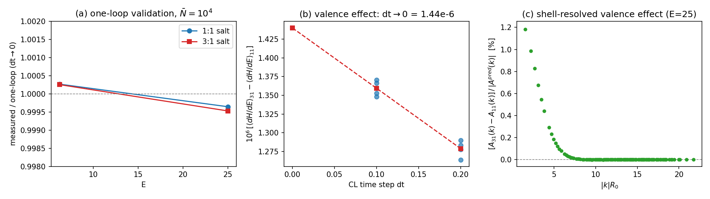

# Multivalent (3:1) Electrolyte: Beyond-Gaussian Ion Correlations from Charged CL-FTS

**Validation report, 2026-08-14** — first multivalent-ion (z = +3) runs of
`ChargedCLFTS`. Bulk-electrolyte step toward reproducing the correlation
physics of Duan, Agrawal & Wang, *PRL* **134**, 048101 (2025)
(`references/2025_prl_duan.pdf`): their polyelectrolyte-brush
collapse/overcharging is driven by valence-specific ion correlations
*beyond* the Gaussian (Debye–Hückel one-loop) level. Here we isolate
exactly that contribution in the simplest periodic setting the current
code supports, with the compressible (ζN) + per-species-smearing model
throughout.

Script: `dh_salt_runs/test_multivalent_oneloop.py`; data
`dh_salt_runs/mv*_*.json`, `mvs*.json`; figure `multivalent_oneloop.png`.

## 1. Design: matched-Debye A/B pair

Two systems with **identical Debye constant** and identical Gaussian
(one-loop) description — all χ = 0, ζN = 100, a = 0.2 (all species),
discrete 1-segment ions, 16³ grid, L = 4, E ∈ {6.25, 25}:

| system | composition | Σ z²φ̄ | frozen aux modes |
|---|---|---|---|
| `11` | P(+1) 1/2, M(−1) 1/2 | 1 | 1 |
| `31` | SP(+3) 1/12, SM(−1) 1/4, S(0) 2/3 | 1 | 2 |

At the Gaussian level the ψ sector depends on the ions only through
$S_{\rm scr}(k) = \sum_i z_i^2 \bar\phi_i \hat h_i^2(k)$, equal for both
systems, so the one-loop lattice prediction (the χ→0, B→∞ limit of the
formula validated in `RESULTS_ONELOOP_DH.md`)

$$\left\langle \frac{\partial H}{\partial E}\right\rangle_{1\text{-loop}}
 = -\frac{1}{2\sqrt{\bar N} V}\sum_{k\ne 0}
   \frac{\kappa/E}{\kappa + u_2}, \qquad
   \kappa = \frac{k^2}{2E},\;\; u_2 = \frac{S_{\rm scr}(k)}{2},$$

is **identical** for `11` and `31`. The variational Gaussian theory of the
PRL (Wang PRE 2010 lineage) likewise predicts zero difference for fixed
uniform densities. Any measured 31−11 difference is therefore a pure
beyond-Gaussian valence effect. Runs are **seed-paired** (identical noise
streams for both systems), which cancels nearly all sampling noise in the
difference.

## 2. One-loop validation at $\bar N = 10^4$ (including z = +3)

100k CL steps, 10k equilibration, dt ∈ {0.2, 0.1}, linear dt→0
extrapolation (seed 12345):

| system | E | dt→0 measured | prediction | ratio |
|---|---:|---:|---:|---:|
| 11 | 6.25 | −5.06413×10⁻² | −5.06277×10⁻² | 1.0003 |
| 31 | 6.25 | −5.06406×10⁻² | −5.06277×10⁻² | 1.0003 |
| 11 | 25 | −1.24288×10⁻² | −1.24333×10⁻² | 0.9996 |
| 31 | 25 | −1.24274×10⁻² | −1.24333×10⁻² | 0.9995 |

Agreement ≤ 0.05% at every point — the multivalent sector (z² factors in
screening, electroneutrality with z = 3, **two** simultaneously frozen
zero-eigenvalue modes) is validated with no adjustable parameters. The
internal identity `dHdE_from_A` (computed from the analytic ψ correlator)
reproduces the direct estimator exactly, as it must.

## 3. Resolved beyond-Gaussian valence effect

Four seed-paired runs per dt at E = 25, $\bar N = 10^4$:

| dt | ⟨dH/dE⟩₃₁ − ⟨dH/dE⟩₁₁ |
|---:|---:|
| 0.2 | +1.279(6)×10⁻⁶ |
| 0.1 | +1.359(5)×10⁻⁶ |
| **dt→0** | **+1.440(12)×10⁻⁶** (≈120σ) |

- Seed-to-seed scatter of the paired difference is ~5×10⁻⁹ — the pairing
  cancels the common Gaussian fluctuations and isolates the systematic
  valence effect.
- Sign: the 3:1 salt is *less negative* — its effective screening is
  **stronger** than its own one-loop description (larger effective
  $u_2$ → smaller per-mode contribution). This is the CL manifestation of
  correlation-induced counterion condensation around the trivalent
  cations (Agrawal & Wang, *JCTC* **18**, 6271 (2022)) — the bulk
  precursor of the overcharging (Γ < 0) mechanism behind brush collapse
  in the PRL.
- Magnitude: 0.012% of the total ⟨dH/dE⟩, but 0.37% of its
  correlation (screening) part at E = 25, growing steeply with coupling
  (0.11% of the correlation part at E = 6.25: extrapolated diff
  +6.7×10⁻⁷). Loop counting predicts the relative effect scales as
  $1/\sqrt{\bar N}$.

**Shell-resolved structure** (panel c of `multivalent_oneloop.png`): the
difference of the analytic ψ correlators $A_{31}(k) - A_{11}(k)$,
normalized by $|A^{\rm pred}(k)|$, is largest at the longest wavelength
(+1.18(1)% at $|k|R_0 = 1.57$) and decays monotonically (+0.44% by
$|k|R_0 = 3.9$): the valence effect is a **long-wavelength enhancement of
screening**, exactly the k → 0 (Debye-constant renormalization) behavior
expected from ion condensation.

## 4. Strong-fluctuation stability boundary ($\bar N = 10^2$)

$\bar N = 10^2$ (the value implied by the PRL's model parameters
v = b³ = 1 nm³, N = 100 — an artifact of their compact-monomer choice,
not of real PEs) is **outside the CL operating range**:

| dt | outcome (E = 25, both systems) |
|---:|---|
| 0.2, 0.1, 0.05 | diverge (ψ/W₊ hot-spot runaway within ~10²–10³ steps) |
| 0.02 | completes 100k steps, but biased: ratio 1.09 (11) / 1.02 (31), Im⟨dH/dE⟩ ~ 10⁻⁴ |

χ = 0 means there are no real auxiliary fields, so `alpha_ds` is inert
here; nothing stabilizes W₊/ψ excursions. Consistent with the project
guideline (user): **CL-FTS operates at $\bar N \sim 10^4$–$10^5$;
$10^5$ is comfortably stable.** PRL-reproduction work should be designed
at that fluctuation strength — physically equivalent to a realistic
monomer volume (v ≈ 0.1 nm³ ⇒ $\bar N \approx 10^4$) rather than the
paper's v = b³.

## 5. Conclusions and next step toward the PRL

1. The multivalent sector of `ChargedCLFTS` is quantitatively validated
   at the Gaussian level (≤0.05%, parameter-free, first z = +3 runs).
2. CL-FTS resolves a systematic beyond-Gaussian valence-specific
   correlation effect — enhanced long-wavelength screening in the 3:1
   salt — at 120σ significance via seed-paired A/B runs. This observable
   is *identically zero* in both the one-loop theory and (for fixed
   uniform densities) the PRL's variational Gaussian theory: it is the
   physics class their approximation truncates.
3. Next (stage 2 of the PRL plan): inhomogeneous setting — grafted
   chains (`q_init` plumbing into `ChargedCLFTS`) + wall boundary
   conditions for the ψ sector (DCT-based ETD/Poisson) — to observe
   correlation-driven ion partitioning/overcharging (Γ < 0) directly, at
   $\bar N = 10^4$–$10^5$ with the compressible + smeared model
   unchanged.
