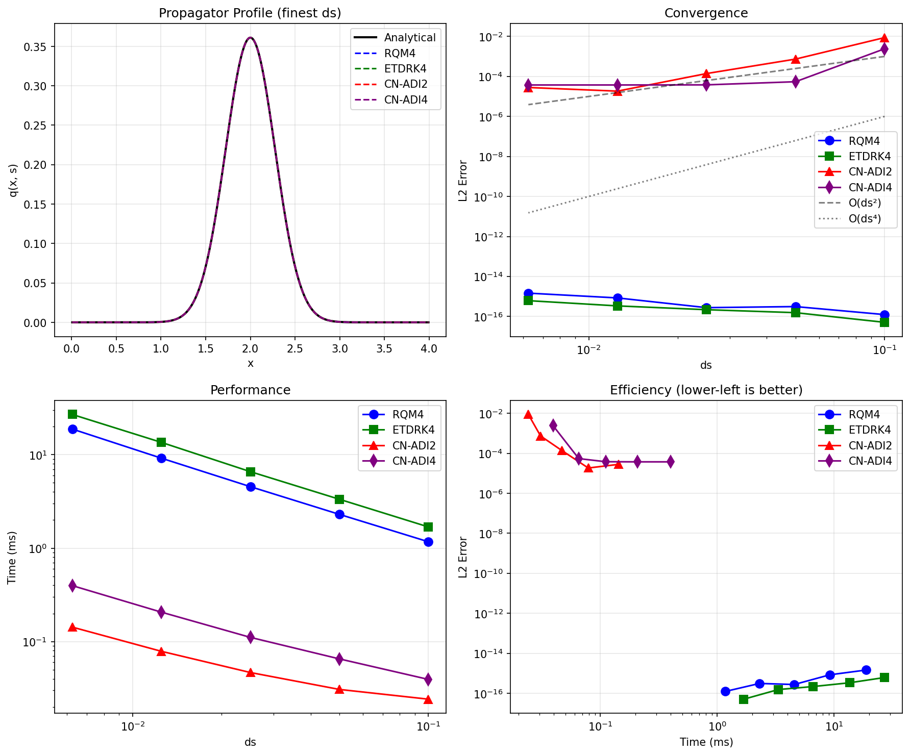

# Numerical Methods: Performance and Accuracy

This document provides benchmark results comparing the numerical methods available for chain propagator computation in polymer field theory simulations.

## Available Methods

All numerical methods are selectable at runtime using the `numerical_method` parameter.

### Pseudo-Spectral Methods

| Method | Order | Description | Reference |
|--------|-------|-------------|-----------|
| **RQM4** | 4th | Richardson extrapolation with Ranjan-Qin-Morse 2008 parameters (default) | *Macromolecules* 41, 942-954 (2008) |
| **ETDRK4** | 4th | Exponential Time Differencing Runge-Kutta | *J. Comput. Phys.* 176, 430-455 (2002) |

### Real-Space Methods

| Method | Order | Description |
|--------|-------|-------------|
| **CN-ADI2** | 2nd | Crank-Nicolson Alternating Direction Implicit (default) |
| **CN-ADI4** | 4th | CN-ADI with Richardson extrapolation |

### Usage Example

```python
from polymerfts import PropagatorSolver

solver = PropagatorSolver(
    nx=[256], lx=[4.0],
    ds=0.01,
    bond_lengths={"A": 1.0},
    bc=["absorbing", "absorbing"],
    chain_model="continuous",
    numerical_method="rqm4",  # or "etdrk4", "cn-adi2", "cn-adi4"
    platform="cpu-mkl",
    reduce_memory_usage=False
)
```

## Grafted Brush Benchmark (1D)

This benchmark tests all four numerical methods on a challenging problem: a polymer brush with absorbing boundary conditions and a Gaussian initial condition.

### Test Configuration

- **System**: Homopolymer grafted to surface (absorbing BC)
- **Grid**: 256 points
- **Domain**: [0, 4.0] (in units of $bN^{1/2}$)
- **Grafting point**: $x_0 = 2.0$ (center)
- **Initial condition**: Gaussian with $\sigma = 0.1$
- **Contour length**: $s = 0.2$
- **Chain model**: Continuous

### Convergence Results

The following table shows L2 error versus analytical solution as the contour step size $ds$ decreases:

| $ds$ | RQM4 | ETDRK4 | CN-ADI2 | CN-ADI4 |
|------|------|--------|---------|---------|
| 0.1 | 1.2×10⁻¹⁶ | 5.1×10⁻¹⁷ | 8.8×10⁻³ | 2.4×10⁻³ |
| 0.05 | 3.1×10⁻¹⁶ | 1.6×10⁻¹⁶ | 7.4×10⁻⁴ | 5.4×10⁻⁵ |
| 0.025 | 2.8×10⁻¹⁶ | 2.2×10⁻¹⁶ | 1.4×10⁻⁴ | 3.8×10⁻⁵ |
| 0.0125 | 8.5×10⁻¹⁶ | 3.4×10⁻¹⁶ | 1.8×10⁻⁵ | 3.7×10⁻⁵ |
| 0.00625 | 1.5×10⁻¹⁵ | 6.2×10⁻¹⁶ | 2.8×10⁻⁵ | 3.7×10⁻⁵ |

**Key Observations:**

1. **Pseudo-spectral methods (RQM4, ETDRK4)** achieve machine precision (~10⁻¹⁶) regardless of $ds$. This is because the Discrete Sine Transform (DST) is spectrally accurate in space, and the error is dominated by spatial discretization which is negligible.

2. **Real-space methods (CN-ADI2, CN-ADI4)** show convergence initially but plateau at ~10⁻⁵ error due to spatial discretization of the finite difference scheme.

3. **CN-ADI4** shows some instability at coarse $ds$, which is consistent with known behavior near absorbing boundaries.

### Performance Comparison

Performance at $ds = 0.01$ (N = 100 contour steps):

| Method | Platform | Time (ms) | L2 Error | Q |
|--------|----------|-----------|----------|---|
| **RQM4** | CPU-MKL | 11.7 | 8.4×10⁻¹⁶ | 0.062665707 |
| **ETDRK4** | CPU-MKL | 16.5 | 5.5×10⁻¹⁶ | 0.062665707 |
| **CN-ADI2** | CPU-MKL | 0.10 | 1.7×10⁻⁵ | 0.062665707 |
| **CN-ADI4** | CPU-MKL | 0.25 | 3.7×10⁻⁵ | 0.062665707 |
| **CN-ADI2** | CUDA | 2.31 | 1.7×10⁻⁵ | 0.062665707 |
| **CN-ADI4** | CUDA | 6.70 | 3.7×10⁻⁵ | 0.062665707 |

**Performance Notes:**

1. **For 1D problems**: CPU is faster than CUDA due to GPU kernel launch overhead. Real-space methods are fastest because tridiagonal solvers are O(N) while FFT is O(N log N).

2. **For 2D/3D problems**: CUDA provides significant speedup (typically 7-10x), and pseudo-spectral methods become competitive.

3. **CUDA pseudo-spectral**: Currently only supports periodic boundary conditions (FFT). For non-periodic BC (DCT/DST), use CPU pseudo-spectral.

### Benchmark Plot



The plot shows:
- **Top-left**: Propagator profile at finest $ds$ - all methods match analytical solution
- **Top-right**: Convergence plot - pseudo-spectral methods achieve machine precision immediately
- **Bottom-left**: Performance scaling - real-space methods are faster for 1D
- **Bottom-right**: Efficiency plot - lower-left is better (pseudo-spectral wins at high accuracy)

## Stability Analysis: Sharp Initial Conditions

When using very sharp initial conditions (e.g., delta-function approximations for grafted brushes), the stability of numerical methods becomes critical. This section analyzes stability thresholds for under-resolved Gaussian initial conditions.

### Test Configuration

- **Grid**: 100 points, $L_x = 5.0$, $\Delta x = 0.05$
- **Initial condition**: Gaussian with $\sigma = 0.01$ (very sharp)
- **Resolution ratio**: $\sigma / \Delta x = 0.2$ (under-resolved)
- **Contour length**: $s = 0.5$
- **Boundary conditions**: Absorbing on both sides

### Stability Thresholds

| Method | Stability Limit | Failure Mode |
|--------|----------------|--------------|
| **RQM4** | Unconditionally stable | N/A |
| **ETDRK4** | Unconditionally stable | N/A |
| **CN-ADI2** | $ds \leq 0.10$ | Negative propagator values |
| **CN-ADI4** | $ds \leq 0.09$ | Negative propagator values |

### Detailed Results

| $ds$ | N steps | RQM4 | ETDRK4 | CN-ADI2 | CN-ADI4 |
|------|---------|------|--------|---------|---------|
| 0.50 | 1 | OK | OK | Negative | Negative |
| 0.25 | 2 | OK | OK | Negative | Negative |
| 0.125 | 4 | OK | OK | Negative | Negative |
| 0.10 | 5 | OK | OK | OK | Negative |
| 0.09 | 6 | OK | OK | OK | OK |
| 0.05 | 10 | OK | OK | OK | OK |

### Why Pseudo-Spectral Methods Are Unconditionally Stable

Pseudo-spectral methods with DST (Discrete Sine Transform) are unconditionally stable because:

1. **Exact eigenfunctions**: The DST basis functions $\sin(n\pi x/L)$ are the exact eigenfunctions of the diffusion operator with absorbing boundary conditions.

2. **Positive propagation**: In spectral space, propagation is multiplication by $\exp(-\lambda_n \cdot ds)$ where $\lambda_n > 0$. This is always positive, regardless of $ds$.

3. **No oscillations**: Unlike finite differences, spectral methods don't introduce spurious oscillations near sharp features.

### Why Real-Space Methods Can Fail

Real-space methods (CN-ADI) can produce negative (unphysical) propagator values because:

1. **Crank-Nicolson oscillations**: The CN scheme can produce oscillations when the solution has features sharper than the grid spacing.

2. **Under-resolved features**: When $\sigma / \Delta x < 1$, the Gaussian is not well-resolved, and CN amplifies the discretization error.

3. **Richardson extrapolation**: CN-ADI4 uses Richardson extrapolation which can amplify oscillations, making it less stable than CN-ADI2.

### Practical Guidelines

1. **For sharp initial conditions** (grafted brushes, delta functions):
   - Prefer **RQM4** or **ETDRK4** (pseudo-spectral) for guaranteed stability
   - If using CN-ADI2, ensure $ds \leq 0.1$ for under-resolved features
   - Avoid CN-ADI4 with sharp features near absorbing boundaries

2. **Resolution requirements**:
   - Ideally $\sigma / \Delta x \geq 2$ for well-resolved Gaussian
   - If under-resolved, use smaller $ds$ for real-space methods

3. **Detecting instability**:
   - Check for negative propagator values: `np.any(q < 0)`
   - Check for NaN/Inf in partition function
   - Large oscillations in the solution profile

## Method Selection Guide

### By Boundary Condition

| Boundary Type | Recommended Method | Reason |
|---------------|-------------------|--------|
| **Periodic** | RQM4 (pseudo-spectral) | Fastest + spectrally accurate |
| **Absorbing** | RQM4 on CPU, CN-ADI2 on CUDA | DST not available on CUDA |
| **Reflecting** | RQM4 on CPU, CN-ADI2 on CUDA | DCT not available on CUDA |
| **Mixed** | CN-ADI2 (real-space) | Most flexible |

### By Accuracy Requirement

| Accuracy Needed | Recommended Method | Notes |
|-----------------|-------------------|-------|
| Machine precision | RQM4, ETDRK4 | Pseudo-spectral achieves ~10⁻¹⁵ |
| High (10⁻⁶) | RQM4 or CN-ADI2 with fine $ds$ | Both work well |
| Moderate (10⁻⁴) | CN-ADI2 | Fast and stable |
| Low (10⁻²) | CN-ADI2 with coarse $ds$ | Maximum speed |

### By Problem Size

| Problem Size | Platform | Recommended Method |
|--------------|----------|-------------------|
| 1D (any N) | CPU-MKL | CN-ADI2 (fastest), RQM4 (most accurate) |
| 2D/3D periodic | CUDA | RQM4 |
| 2D/3D non-periodic | CUDA | CN-ADI2 |

### RQM4 vs ETDRK4

Both are 4th-order accurate for pseudo-spectral solvers:

| Criterion | RQM4 | ETDRK4 |
|-----------|------|--------|
| **FFTs per step** | 6 | 8 |
| **Stability** | Good for typical $ds$ | L-stable (better for stiff problems) |
| **Memory** | Lower | Higher (stores phi coefficients) |
| **Speed** | ~1.4x faster | Slower but more stable |

### CN-ADI2 vs CN-ADI4

| Criterion | CN-ADI2 | CN-ADI4 |
|-----------|---------|---------|
| **Order** | 2nd | 4th |
| **Steps per ds** | 1 | 2 (Richardson extrapolation) |
| **Speed** | Faster | ~2.5x slower |
| **Stability** | More stable | May be unstable near absorbing BC |
| **Best for** | Most applications | When 2nd order is insufficient |

## Recommendations

### For Bulk Systems (SCFT, L-FTS, CL-FTS)

1. Use **RQM4** (pseudo-spectral, default)
2. Set $ds = 0.01$ ($N=100$) for most calculations
3. Reduce to $ds = 0.005$ for high-precision comparisons
4. Use **CUDA** platform for 2D/3D systems
5. Consider **ETDRK4** for stiff problems where RQM4 shows instability

### For Confined Systems (Brushes, Thin Films)

1. Use **RQM4** on CPU-MKL for absorbing/reflecting BC (highest accuracy)
2. Use **CN-ADI2** on CUDA for large 2D/3D confined systems
3. Avoid **CN-ADI4** near absorbing boundaries (potential instability)

### Performance Optimization

1. **GPU**: Use CUDA for all 2D/3D simulations with periodic BC
2. **CPU**: Use for 1D problems or non-periodic BC
3. **Memory**: For large grids, enable `reduce_memory_usage=True`

## Benchmark Scripts

```bash
# Grafted brush benchmark (1D, absorbing BC)
python tests/test_grafted_brush_validation.py

# Phase benchmarks (3D, periodic BC)
python tests/benchmark_phases.py cuda
python tests/benchmark_phases.py cpu-mkl

# Basic numerical methods comparison
python tests/benchmark_numerical_methods.py
```

## References

1. A. Ranjan, J. Qin, and D. C. Morse, **"Linear Response and Stability of Ordered Phases of Block Copolymer Melts"**, *Macromolecules*, **2008**, 41, 942-954.
   - RQM4 parameters for Richardson extrapolation

2. S. M. Cox and P. C. Matthews, **"Exponential Time Differencing for Stiff Systems"**, *J. Comput. Phys.*, **2002**, 176, 430-455.
   - ETDRK4 algorithm

3. P. Stasiak and M. W. Matsen, **"Efficiency of pseudo-spectral algorithms with Anderson mixing for the SCFT of periodic block-copolymer phases"**, *Eur. Phys. J. E*, **2011**, 34, 110.
   - Convergence analysis methodology

4. J. Song, Y. Liu, and R. Zhang, **"Exponential Time Differencing Schemes for Solving the Self-Consistent Field Equations of Polymers"**, *Chinese J. Polym. Sci.*, **2018**, 36, 488-496.
   - ETDRK4 for polymer field theory, performance benchmarks
