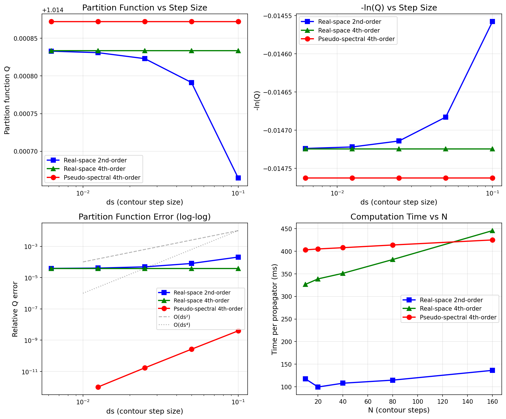

# Real-Space Solver Documentation

This document describes the real-space finite difference solver for continuous chain propagators, including its numerical methods, boundary condition support, and performance characteristics.

## Overview

The real-space solver uses the **Crank-Nicolson ADI** (Alternating Direction Implicit) method to solve the modified diffusion equation:

$$\frac{\partial q}{\partial s} = \frac{b^2}{6} \nabla^2 q - w(\mathbf{r}) q$$

Unlike the pseudo-spectral method which requires periodic boundary conditions, the real-space method supports:

| Boundary Condition | Description | Mathematical Form |
|-------------------|-------------|-------------------|
| **Periodic** | Cyclic boundary | $q(0) = q(L)$ |
| **Reflecting** | Neumann (zero flux) | $\partial q / \partial n = 0$ |
| **Absorbing** | Dirichlet (zero value) | $q = 0$ at boundary |

## Numerical Method

### Crank-Nicolson Scheme

The Crank-Nicolson method is a semi-implicit scheme that is unconditionally stable:

$$(I - \frac{\Delta s}{2} L) q^{n+1} = (I + \frac{\Delta s}{2} L) q^n$$

where $L$ is the discrete Laplacian operator combined with the potential term.

### ADI Splitting (3D)

For 3D problems, the operator is split into three sequential 1D solves:

1. **X-direction sweep**: Solve tridiagonal system for $q^*$
2. **Y-direction sweep**: Solve tridiagonal system for $q^{**}$
3. **Z-direction sweep**: Solve tridiagonal system for $q^{n+1}$

Each direction requires solving a tridiagonal (or cyclic tridiagonal for periodic BC) system using:
- **Thomas algorithm**: For non-periodic boundaries
- **Sherman-Morrison formula**: For periodic boundaries

### Symmetric Splitting with Potential

The propagator advancement includes the potential term using symmetric splitting:

$$q^{n+1} = e^{-w \Delta s/2} \cdot \text{Diffusion}(\Delta s) \cdot e^{-w \Delta s/2} \cdot q^n$$

This ensures the scheme remains symmetric and accurate.

## Richardson Extrapolation (4th-Order Accuracy)

Optionally, the solver can use **4th-order Richardson extrapolation** to achieve higher temporal accuracy. This combines one full step with two half-steps:

$$q_{\text{out}} = \frac{4 \cdot q_{\text{half}} - q_{\text{full}}}{3}$$

where:
- $q_{\text{full}}$: Result from one full step of size $\Delta s$
- $q_{\text{half}}$: Result from two half-steps of size $\Delta s/2$ each

This cancels the $O(\Delta s^2)$ error term, yielding $O(\Delta s^4)$ accuracy.

### Compile-Time Toggle

Richardson extrapolation can be enabled at compile time for higher accuracy (but may be unstable near absorbing boundaries):

```bash
# 2nd-order (default - faster, more stable)
cmake ../ -DCMAKE_BUILD_TYPE=Release

# 4th-order (more accurate, but may be unstable near absorbing boundaries)
cmake ../ -DCMAKE_BUILD_TYPE=Release -DPOLYMERFTS_USE_RICHARDSON=ON
```

## Performance Benchmarks

### Test Configuration

- **Polymer**: AB Diblock copolymer (f = 0.5)
- **Chain model**: Continuous
- **Box**: 4.0 x 4.0 x 4.0
- **Hardware**: NVIDIA H100 GPU

### Computation Time vs Contour Steps (32³ grid, CUDA)

| N (ds=1/N) | 2nd-Order | 4th-Order | Pseudo-Spectral | 4th/2nd Ratio |
|------------|-----------|-----------|-----------------|---------------|
| 10 (0.1)   | 117 ms    | 327 ms    | 403 ms          | 2.8x          |
| 20 (0.05)  | 99 ms     | 339 ms    | 405 ms          | 3.4x          |
| 40 (0.025) | 108 ms    | 351 ms    | 408 ms          | 3.3x          |
| 80 (0.0125)| 115 ms    | 382 ms    | 414 ms          | 3.3x          |
| 160 (0.00625)| 136 ms  | 446 ms    | 425 ms          | 3.3x          |

### Key Observations

1. **4th-order is ~3x slower than 2nd-order**: This matches the expected computational cost:
   - 4th-order: 1 full step + 2 half-steps = 3 ADI solves per contour step
   - 2nd-order: 1 full step = 1 ADI solve per contour step

2. **Real-space 2nd-order is fastest**: About 3-4x faster than both 4th-order methods

3. **4th-order real-space comparable to pseudo-spectral**: Similar computation time on GPU

### Scaling Analysis

The real-space method scales as:
- **Time complexity**: O(M) per direction, O(3M) per ADI step (3D)
- **Memory complexity**: O(M) for propagators + O(N_x + N_y + N_z) for tridiagonal coefficients

Compared to pseudo-spectral (O(M log M) per step), real-space is:
- Faster for very small grids
- Slower for large grids
- Essential when non-periodic boundaries are required

## Accuracy and Convergence

### Convergence Study Results

The following results compare the partition function Q computed with different methods for an AB diblock copolymer (f=0.5, χN=12) with a fixed lamellar external field on a 32³ grid.

#### Partition Function Q vs Contour Discretization

| N (ds=1/N) | 2nd-Order Real-Space | 4th-Order Real-Space | Pseudo-Spectral |
|------------|---------------------|---------------------|-----------------|
| 10         | 1.014664450650      | 1.014833599719      | 1.014872188468  |
| 20         | 1.014791309578      | 1.014833596455      | 1.014872184716  |
| 40         | 1.014823024545      | 1.014833596238      | 1.014872184464  |
| 80         | 1.014830953303      | 1.014833596224      | 1.014872184448  |
| 160        | 1.014832935493      | 1.014833596223      | 1.014872184447  |

#### Relative Error vs Pseudo-Spectral Reference (N=160)

| N | 2nd-Order Error | 4th-Order Error |
|---|-----------------|-----------------|
| 10 | 0.0205% | 0.0038% |
| 20 | 0.0080% | 0.0038% |
| 40 | 0.0048% | 0.0038% |
| 80 | 0.0041% | 0.0038% |
| 160 | 0.0039% | 0.0038% |

#### Measured Convergence Order

| Method | Estimated Order p |
|--------|-------------------|
| 2nd-Order Real-Space | **p ≈ 2.0** |
| 4th-Order Real-Space | **p ≈ 3.9** |
| Pseudo-Spectral (RQM4) | **p ≈ 4.0** |

#### Convergence Plot (Periodic Boundaries)



*Top-left: Partition function Q vs contour step size. Top-right: -ln(Q) vs step size. Bottom-left: Relative error (log-log) showing O(ds²) and O(ds⁴) convergence. Bottom-right: Computation time vs number of contour steps.*

### Key Findings

1. **Richardson extrapolation achieves 4th-order accuracy**: The measured convergence order of ~3.9 confirms that Richardson extrapolation successfully improves temporal accuracy from O(ds²) to O(ds⁴).

2. **Systematic difference between methods**: There is a ~0.0038% systematic difference between real-space and pseudo-spectral methods, arising from different spatial discretization (finite difference vs spectral).

3. **2nd-order converges as expected**: The 2nd-order method shows clear O(ds²) convergence, with error decreasing by ~4x when ds is halved.

4. **4th-order converges quickly**: The 4th-order real-space method is essentially converged by N=10, with further refinement showing negligible improvement.

5. **Pseudo-spectral most accurate**: For periodic boundary conditions, pseudo-spectral remains the most accurate method, converging to machine precision even at coarse ds.

### Grafted Brush Validation (Absorbing Boundaries)

To validate solvers with non-periodic boundary conditions, we test a grafted brush configuration:

- **Setup**: 1D domain with absorbing boundaries on both sides
- **Initial condition**: Gaussian centered at x₀ = 2.0 (center), varying σ
- **Grid**: 512 points, Lx = 4.0
- **Comparison**: Numerical vs analytical Fourier series solution

The analytical solution for diffusion with absorbing BCs and Gaussian initial condition is:

$$q(x,s) = \frac{2}{L} \sum_{n=1}^{\infty} a_n \sin\left(\frac{n\pi x}{L}\right) \exp\left(-\frac{n^2\pi^2 b^2 s}{6L^2}\right)$$

where $a_n$ are the Fourier sine coefficients of the initial Gaussian.

#### Real-Space vs Pseudo-Spectral Comparison

For absorbing boundaries, two methods are available:
- **Real-space (Crank-Nicolson)**: 2nd-order temporal accuracy
- **Pseudo-spectral (DST)**: Spectral accuracy using Discrete Sine Transform

**Convergence Study (σ = 0.02, very sharp Gaussian):**

| ds | N_steps | Real-Space L2 Error | Pseudo-Spectral L2 Error |
|----|---------|---------------------|--------------------------|
| 0.1 | 2 | 5.04×10⁻² | 4.69×10⁻¹⁷ |
| 0.05 | 4 | 2.69×10⁻² | 5.29×10⁻¹⁷ |
| 0.025 | 8 | 7.55×10⁻³ | 1.16×10⁻¹⁶ |
| 0.0125 | 16 | 5.58×10⁻⁴ | 4.02×10⁻¹⁶ |
| 0.00625 | 32 | 2.77×10⁻⁶ | — |
| 0.003125 | 64 | 1.81×10⁻⁶ | — |

#### Effect of Gaussian Sharpness

The initial condition width σ affects accuracy. Results with ds = 0.005:

| σ | σ/dx | Real-Space Error | Pseudo-Spectral Error |
|-------|------|------------------|----------------------|
| 0.400 | 51.2 | 2.94×10⁻⁶ | 2.54×10⁻¹¹ |
| 0.200 | 25.6 | 5.04×10⁻⁶ | 2.13×10⁻¹⁵ |
| 0.100 | 12.8 | 4.28×10⁻⁶ | 2.46×10⁻¹⁵ |
| 0.050 | 6.4 | 2.56×10⁻⁶ | 1.30×10⁻¹⁵ |
| 0.020 | 2.6 | 1.10×10⁻⁶ | 6.24×10⁻¹⁶ |
| 0.010 | 1.3 | 4.01×10⁻⁵ | 2.93×10⁻¹⁶ |

#### Key Findings

1. **Pseudo-spectral (DST) achieves machine precision**: For all Gaussian widths tested, the DST-based solver achieves ~10⁻¹⁵ to 10⁻¹⁶ error regardless of σ.

2. **Real-space has spatial discretization error**: Error increases when σ/dx < 3 (under-resolved Gaussian). For well-resolved cases (σ/dx > 5), error is ~10⁻⁶.

3. **Real-space convergence order**: Approximately p ≈ 2 for the Crank-Nicolson method, reaching a spatial error floor at fine ds.

4. **Absorbing BCs work correctly**: Both methods properly handle Dirichlet boundary conditions, with propagators decaying to ~10⁻¹⁵ at boundaries.

5. **Resolution requirement**: Real-space method needs σ/dx ≳ 3-5 for accurate results with sharp initial conditions.

#### Method Selection for Absorbing Boundaries

| Criterion | Recommended Method |
|-----------|-------------------|
| Maximum accuracy | Pseudo-spectral (DST) |
| Sharp initial condition (σ/dx < 3) | Pseudo-spectral (DST) |
| Simple geometry, periodic in other directions | Pseudo-spectral (DST) |
| Non-uniform grids or complex geometries | Real-space (with sufficient resolution) |

#### Stability Warning: Grafting Points Near Boundaries

**Important**: 4th-order Richardson extrapolation can become unstable when the initial condition (grafting point) is close to an absorbing boundary. Testing shows:

| x₀/σ from boundary | Richardson 4th-Order | Crank-Nicolson 2nd-Order |
|-------------------|----------------------|--------------------------|
| > 5σ | Stable | Stable |
| 2-3σ | **Unstable** | Stable |
| < 2σ | **Diverges** | Stable |

**Recommendation**: For grafted brush simulations:
- Use pseudo-spectral (DST) when possible - it achieves spectral accuracy
- For real-space: ensure σ/dx > 5 for accuracy, and avoid Richardson extrapolation near boundaries

## Usage

### Python Interface

```python
params = {
    "nx": [32, 32, 32],
    "lx": [4.0, 4.0, 4.0],
    "chain_model": "continuous",
    "ds": 0.01,

    # Boundary conditions: "periodic", "reflecting", or "absorbing"
    "bc": ["reflecting", "reflecting",    # x-direction (low, high)
           "reflecting", "reflecting",    # y-direction (low, high)
           "absorbing", "absorbing"],     # z-direction (low, high)

    # Real-space method is automatically selected for non-periodic BC
    # Or force it explicitly:
    "propagator_method": "realspace",

    # ... other parameters
}
```

### Mixed Boundary Conditions

Different boundary conditions can be specified for each direction:

```python
# Confined film: reflecting in z, periodic in x and y
"bc": ["periodic", "periodic",      # x: periodic
       "periodic", "periodic",      # y: periodic
       "reflecting", "reflecting"]  # z: reflecting (confined)

# Semi-infinite slab: absorbing on one side
"bc": ["periodic", "periodic",
       "periodic", "periodic",
       "reflecting", "absorbing"]   # z: reflecting bottom, absorbing top
```

### Grafted Brush Example

For polymer brushes grafted to a surface, use a delta-function initial condition with absorbing boundaries:

```python
from polymerfts import PropagatorSolver
import numpy as np

# 1D grafted brush with absorbing boundaries
solver = PropagatorSolver(
    nx=[128],
    lx=[4.0],
    ds=0.01,
    bond_lengths={"A": 1.0},
    bc=["absorbing", "absorbing"],  # Absorbing on both sides
    chain_model="continuous",
    method="realspace",
    platform="cpu-mkl",
    reduce_memory_usage=False
)

# Add polymer with grafting point at node 0
solver.add_polymer(
    volume_fraction=1.0,
    blocks=[["A", 1.0, 0, 1]],
    grafting_points={0: "G"}  # Node 0 uses custom q_init
)

# Create delta-function initial condition at grafting point
dx = 4.0 / 128
x = (np.arange(128) + 0.5) * dx
x0 = 0.5  # Grafting point position

# Gaussian approximation to delta function
sigma = 0.1
q_init = np.exp(-(x - x0)**2 / (2 * sigma**2))
q_init = q_init / (np.sum(q_init) * dx)  # Normalize

# Compute propagators with zero field
w_field = np.zeros(128)
solver.compute_propagators({"A": w_field}, q_init={"G": q_init})

# Get propagator at chain end
q_end = solver.get_propagator(polymer=0, v=0, u=1, step=100)
Q = solver.get_partition_function(polymer=0)
```

## Implementation Details

### Files

| File | Description |
|------|-------------|
| `src/platforms/cpu/CpuSolverRealSpace.cpp` | CPU implementation |
| `src/platforms/cpu/CpuSolverRealSpace.h` | CPU header |
| `src/platforms/cuda/CudaSolverRealSpace.cu` | CUDA implementation |
| `src/platforms/cuda/CudaSolverRealSpace.h` | CUDA header |
| `src/common/FiniteDifference.cpp` | Tridiagonal coefficient generation |

### Tridiagonal Solvers

**Non-periodic (Thomas Algorithm)**:
- Forward elimination followed by back substitution
- CUDA: Uses shared memory for coefficient caching
- CPU: Direct sequential solve

**Periodic (Sherman-Morrison)**:
- Converts cyclic system to standard tridiagonal + correction
- Solves two systems and combines results
- CUDA: Optimized with register reuse

### CUDA Optimizations

- **Shared memory**: Tridiagonal coefficients cached in shared memory
- **Coalesced access**: Data layout optimized for memory coalescing
- **Stream support**: Multiple propagators computed concurrently
- **Dynamic parallelism**: Each thread handles one tridiagonal system

## Limitations

1. **Stress computation**: Not yet implemented for real-space method
2. **Discrete chains**: Only continuous chain model supported
3. **Non-orthogonal cells**: Only orthogonal unit cells supported
4. **Complex fields**: Only real-valued fields supported

## When to Use Real-Space vs Pseudo-Spectral

### Use Real-Space When:
- Non-periodic boundary conditions are required (confined systems, interfaces)
- Small grid sizes where real-space is competitive
- Accuracy requirements favor 4th-order Richardson extrapolation

### Use Pseudo-Spectral When:
- Periodic boundary conditions are acceptable
- Large grid sizes (pseudo-spectral scales better)
- Stress calculations are needed
- Maximum performance is required

## References

1. **Crank-Nicolson Method**: J. Crank and P. Nicolson, "A practical method for numerical evaluation of solutions of partial differential equations of the heat-conduction type", *Proc. Cambridge Phil. Soc.*, **1947**, 43, 50-67.

2. **ADI Method**: D. W. Peaceman and H. H. Rachford, "The numerical solution of parabolic and elliptic differential equations", *J. Soc. Indust. Appl. Math.*, **1955**, 3, 28-41.

3. **Richardson Extrapolation**: L. F. Richardson, "The approximate arithmetical solution by finite differences of physical problems involving differential equations", *Phil. Trans. R. Soc. A*, **1911**, 210, 307-357.

4. **Thomas Algorithm**: L. H. Thomas, "Elliptic problems in linear differential equations over a network", Watson Sci. Comput. Lab Report, Columbia University, **1949**.
