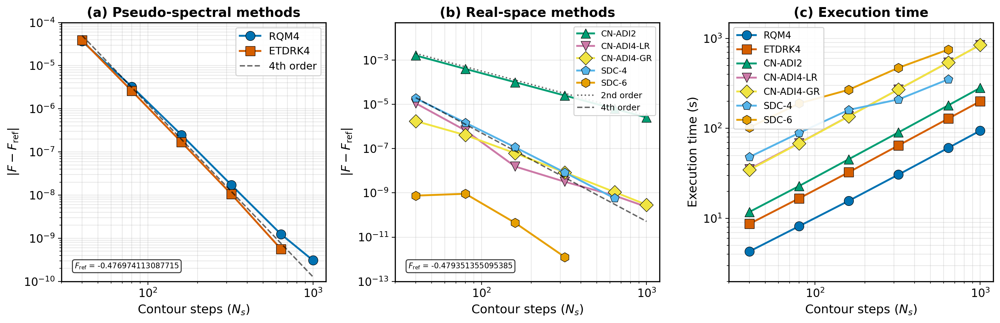

# Numerical Methods for Polymer Field Theory

> **Warning:** This document was generated with assistance from a large language model (LLM). While it is based on the referenced literature and the codebase, it may contain errors, misinterpretations, or inaccuracies. Please verify the equations and descriptions against the original references before relying on this document for research or implementation.

This document provides comprehensive documentation of the numerical methods available for solving the modified diffusion equation in polymer self-consistent field theory (SCFT), with emphasis on supporting both orthogonal and non-orthogonal crystal systems.

## Table of Contents

1. [Overview](#1-overview)
2. [Modified Diffusion Equation](#2-modified-diffusion-equation)
3. [Pseudo-Spectral Methods](#3-pseudo-spectral-methods)
4. [Real-Space Methods](#4-real-space-methods)
5. [Material Conservation](#5-material-conservation)
6. [Performance Benchmarks](#6-performance-benchmarks)
7. [Method Selection Guide](#7-method-selection-guide)
8. [Crystal System Constraints](#8-crystal-system-constraints)
9. [References](#9-references)

---

## 1. Overview

### Quick Reference

| Method | Order | Solver Type | Speed (vs CN-ADI2) | Material Conservation |
|--------|-------|-------------|-------------------|----------------------|
| **RQM4** | 4th | Pseudo-spectral | 3.0x faster | Exact (~10⁻¹⁶) |
| **RK2** | 2nd | Pseudo-spectral | 7.8x faster | Exact (~10⁻¹⁶) |
| **CN-ADI2** | 2nd | Real-space | baseline | Exact (~10⁻¹⁵) |

### Decision Guide

| Use Case | Recommended Method |
|----------|-------------------|
| Standard SCFT/FTS (periodic BC) | **RQM4** (default) |
| Fast iterations, prototyping | **RK2** |
| Non-periodic boundaries | **CN-ADI2** |

### Runtime Selection

```python
from polymerfts import SCFT

params = {
    "nx": [32, 32, 32],
    "lx": [3.3, 3.3, 3.3],
    "ds": 0.01,
    "chain_model": "continuous",
    "numerical_method": "rqm4",  # or "rk2", "cn-adi2"
    # ... other parameters
}

calculation = SCFT(params=params)
```

---

## 2. Modified Diffusion Equation

In polymer field theory, the chain propagator $q(\mathbf{r}, s)$ satisfies the modified diffusion equation:

$$\frac{\partial q(\mathbf{r}, s)}{\partial s} = \frac{b^2}{6} \nabla^2 q(\mathbf{r}, s) - w(\mathbf{r}) q(\mathbf{r}, s)$$

where:
- $q(\mathbf{r}, s)$ is the chain propagator at position $\mathbf{r}$ and contour variable $s$
- $b$ is the statistical segment length
- $w(\mathbf{r})$ is the potential field
- $s \in [0, 1]$ parameterizes position along the chain contour

The initial condition is typically $q(\mathbf{r}, 0) = 1$ for a free chain end.

### Boundary Conditions

Both pseudo-spectral and real-space methods support the following boundary conditions:

| Boundary Condition | Description | Mathematical Form | Transform |
|-------------------|-------------|-------------------|-----------|
| **Periodic** | Cyclic boundary | $q(0) = q(L)$ | FFT |
| **Reflecting** | Neumann (zero flux) | $\partial q / \partial n = 0$ | DCT |
| **Absorbing** | Dirichlet (zero value) | $q = 0$ at boundary | DST |

---

## 3. Pseudo-Spectral Methods

Pseudo-spectral methods use spectral transforms to solve the diffusion operator efficiently. The transform type depends on boundary conditions:
- **Periodic BC**: Fast Fourier Transform (FFT)
- **Reflecting BC**: Discrete Cosine Transform (DCT-II/III)
- **Absorbing BC**: Discrete Sine Transform (DST-II/III)

All pseudo-spectral methods use **cell-centered grids** where grid points are at $x_i = (i + 0.5) \cdot dx$ for $i = 0, 1, ..., N-1$, with boundaries at cell faces (not grid points).

### 3.1 Lattice Vectors and Metric Tensors

#### Real-Space Lattice Vectors

For a general crystal system, the simulation box is defined by three lattice vectors $\mathbf{a}$, $\mathbf{b}$, $\mathbf{c}$ with lengths $L_a$, $L_b$, $L_c$ and angles:
- $\alpha$: angle between $\mathbf{b}$ and $\mathbf{c}$
- $\beta$: angle between $\mathbf{a}$ and $\mathbf{c}$
- $\gamma$: angle between $\mathbf{a}$ and $\mathbf{b}$

Using the standard crystallographic convention:
- $\mathbf{a}$ along the x-axis
- $\mathbf{b}$ in the xy-plane
- $\mathbf{c}$ in general position

The metric tensor $G_{ij}$ relates the dot product of lattice vectors:

$$G = \begin{pmatrix} L_a^2 & L_a L_b \cos\gamma & L_a L_c \cos\beta \\ L_a L_b \cos\gamma & L_b^2 & L_b L_c \cos\alpha \\ L_a L_c \cos\beta & L_b L_c \cos\alpha & L_c^2 \end{pmatrix}$$

#### Reciprocal Lattice

The reciprocal metric tensor $g^{-1} = (2\pi)^2 G^{-1}$ gives the squared wavevector magnitude:

$$|\mathbf{k}|^2 = g_{11}^* n_1^2 + g_{22}^* n_2^2 + g_{33}^* n_3^2 + 2g_{12}^* n_1 n_2 + 2g_{13}^* n_1 n_3 + 2g_{23}^* n_2 n_3$$

For **orthogonal systems** ($\alpha = \beta = \gamma = 90°$), the cross-terms vanish:

$$|\mathbf{k}|^2 = \left(\frac{2\pi n_1}{L_a}\right)^2 + \left(\frac{2\pi n_2}{L_b}\right)^2 + \left(\frac{2\pi n_3}{L_c}\right)^2$$

### 3.2 RK2 (Rasmussen-Kalosakas)

The **Rasmussen-Kalosakas (RK) algorithm** [2] uses symmetric operator splitting with 2nd-order accuracy.

> **Note**: RK here refers to Rasmussen-Kalosakas, not Runge-Kutta.

For the modified diffusion equation with Hamiltonian operator $\hat{H} = -\frac{b^2}{6}\nabla^2 + w(\mathbf{r})$, the RK algorithm approximates the propagator step using symmetric Strang splitting:

$$e^{-\hat{H}\Delta s} \approx e^{-\frac{1}{2}w\Delta s} \cdot e^{\frac{b^2}{6}\nabla^2 \Delta s} \cdot e^{-\frac{1}{2}w\Delta s}$$

**Algorithm:**

1. **Potential half-step** (real space):
   $$q^* = \exp\left(-\frac{w \Delta s}{2}\right) q^n$$

2. **Diffusion step** (Fourier space):
   $$\hat{q}^{**} = \exp\left(-\frac{b^2 k^2 \Delta s}{6}\right) \hat{q}^*$$

3. **Potential half-step** (real space):
   $$q^{n+1} = \exp\left(-\frac{w \Delta s}{2}\right) q^{**}$$

**Properties:**
- **2nd-order accuracy** in $\Delta s$ (convergence order ≈ 2.0)
- Time-reversible (due to symmetric splitting)
- 2 FFTs per step
- Fastest method (2.6x faster than RQM4 per iteration)

> **Note**: RK2 for continuous chains is mathematically equivalent to the **N-bond model** for discrete chains described in Park et al. (2019) [5]. Both use the same Boltzmann factor $e^{-b^2 k^2 \Delta s / 6}$ in Fourier space.

### 3.3 RQM4 (Richardson Extrapolation)

**RQM4** (Ranjan-Qin-Morse 4th-order) [6] extends the RK algorithm to 4th-order accuracy using Richardson extrapolation.

**Algorithm:**

For one full step from $s_n$ to $s_{n+1} = s_n + \Delta s$:

1. **Full step**: Apply RK once with step size $\Delta s$:
   $$q_{full} = q_{RK}(s_{n+1}; \Delta s)$$

2. **Half steps**: Apply RK twice with step size $\Delta s/2$:
   $$q_{half} = q_{RK}(s_{n+1}; \Delta s/2)$$

3. **Richardson extrapolation**:
   $$q^{n+1} = \frac{4 q_{half} - q_{full}}{3}$$

**Properties:**
- **4th-order accuracy** in $\Delta s$ (convergence order ≈ 4.0)
- 6 FFTs per step (3 RK applications)
- Default method for highest accuracy

### 3.4 Discrete Chain Model

For discrete chains, the propagator is computed using **recursive integral equations** (Chapman-Kolmogorov equations) rather than solving a differential equation.

**Units and Conventions:**
- **Unit length**: $R_0 = aN^{1/2}$, where $a$ is the statistical segment length and $N$ is the polymerization index
- **Contour step size**: $\Delta s = 1/N$
- A polymer chain has **N segments** (monomers) connected by **N-1 bonds**

The propagator evolution from segment $i$ to segment $i+1$ follows:

1. **Bond convolution** (Fourier space):
   $$\hat{q}^*(\mathbf{k}) = \hat{g}(\mathbf{k}) \cdot \hat{q}_i(\mathbf{k})$$

2. **Full-segment Boltzmann weight** (real space):
   $$q_{i+1}(\mathbf{r}) = \exp(-w(\mathbf{r}) \Delta s) \cdot q^*(\mathbf{r})$$

where $\hat{g}(\mathbf{k}) = \exp\left(-\frac{b^2 |\mathbf{k}|^2 \Delta s}{6}\right)$ is the Fourier transform of the Gaussian bond function.

### 3.5 Boltzmann Weight Calculation

For each wavevector index $(n_1, n_2, n_3)$:

```
k_sq = g_inv_11 * n1^2 + g_inv_22 * n2^2 + g_inv_33 * n3^2
     + 2 * g_inv_12 * n1 * n2
     + 2 * g_inv_13 * n1 * n3
     + 2 * g_inv_23 * n2 * n3

boltz_bond[idx] = exp(-b^2 * k_sq * ds / 6)
```

---

## 4. Real-Space Methods

Real-space methods use finite difference discretization instead of spectral transforms. They use **cell-centered grids** (same as pseudo-spectral methods) for consistent boundary condition handling.

### 4.1 Grid Discretization

Grid points are located at cell centers:

$$x_i = \left(i + \frac{1}{2}\right) \Delta x, \quad i = 0, 1, \ldots, N-1$$

**Boundary condition implementation using ghost cells:**

| BC Type | Ghost Cell Value | Effect on Laplacian |
|---------|------------------|---------------------|
| **Periodic** | $q_{-1} = q_{N-1}$ | Cyclic tridiagonal system |
| **Reflecting** | $q_{-1} = q_0$ (symmetric) | Diagonal += off-diagonal |
| **Absorbing** | $q_{-1} = -q_0$ (antisymmetric) | Diagonal -= off-diagonal |

### 4.2 CN-ADI2 (Crank-Nicolson ADI)

The Crank-Nicolson method is a semi-implicit scheme that is unconditionally stable:

$$(I - \frac{\Delta s}{2} L) q^{n+1} = (I + \frac{\Delta s}{2} L) q^n$$

where $L$ is the discrete Laplacian operator combined with the potential term.

**ADI Splitting (3D):**

For 3D problems, the operator is split into three sequential 1D solves:

1. **X-direction sweep**: Solve tridiagonal system for $q^*$
2. **Y-direction sweep**: Solve tridiagonal system for $q^{**}$
3. **Z-direction sweep**: Solve tridiagonal system for $q^{n+1}$

Each direction requires solving a tridiagonal (or cyclic tridiagonal for periodic BC) system using:
- **Thomas algorithm**: For non-periodic boundaries ($O(N)$)
- **Sherman-Morrison formula**: For periodic boundaries ($O(N)$ with constant overhead)

**Properties:**
- **2nd-order accuracy** in both space and time
- Supports periodic, reflecting, and absorbing boundaries
- CUDA parallelizes across systems, solving thousands of tridiagonal systems simultaneously

### 4.3 Limitations

Real-space methods have some limitations compared to pseudo-spectral methods:

1. **Stress computation**: Not yet implemented
2. **Discrete chains**: Only continuous chain model supported
3. **Non-orthogonal cells**: Only orthogonal unit cells supported
4. **Spatial accuracy**: $O(\Delta x^2)$ vs spectral (exponential) accuracy

---

## 5. Material Conservation

Material conservation requires that forward and backward partition functions are equal ($Q_{forward} = Q_{backward}$). This is ensured when the evolution operator $U$ satisfies the Hermiticity condition $(VU)^\dagger = VU$ where $V$ is the volume matrix.

| Method | Conservation | Mechanism |
|--------|--------------|-----------|
| **RQM4** | Exact (~10⁻¹⁶) | Symmetric splitting: $e^{-w \cdot ds/2} \cdot e^{L \cdot ds} \cdot e^{-w \cdot ds/2}$ |
| **RK2** | Exact (~10⁻¹⁶) | Same symmetric splitting as RQM4 |
| **CN-ADI2** | Exact (~10⁻¹⁵) | Symmetric Crank-Nicolson time stepping |

**Reference**: Yong & Kim, *Phys. Rev. E* **2017**, 96, 063312

---

## 6. Performance Benchmarks

The benchmarks below reproduce Fig. 1 from Song et al., *Chinese J. Polym. Sci.* **2018**, 36, 488-496.

> **Note**: **ETDRK4** and **CN-ADI4-LR** are not supported in the current codebase. The benchmark data below are retained for historical comparison only.

### Benchmark Configuration

- **Platform**: NVIDIA A10 GPU (CUDA)
- **System**: AB diblock copolymer, Gyroid phase
- **Conditions**: f = 0.375, χN = 18, M = 32³, L = 3.65
- **SCFT convergence**: tolerance = 10⁻⁹
- **Max iterations**: 2000
- **Date**: 2026-01-15

### Convergence Plot



**(a)** Pseudo-spectral 4th-order methods (RQM4, ETDRK4) show 4th-order convergence, while RK2 shows 2nd-order convergence. **(b)** Real-space methods: CN-ADI2 shows 2nd-order convergence, CN-ADI4-LR shows 4th-order convergence. Note: Real-space methods use F_ref = -0.47935 due to finite-difference spatial discretization. **(c)** Execution time comparison for all methods.

### Free Energy vs Contour Steps (Ns)

| Method | Ns=40 | Ns=80 | Ns=160 | Ns=320 | Ns=640 | Ns=1000 |
|--------|-------|-------|--------|--------|--------|---------|
| **RQM4** | -0.477010930978363 | -0.476977370031310 | -0.476974360495475 | -0.476974130350877 | -0.476974114332803 | -0.476974113395157 |
| **RK2** | -0.475796762870488 | -0.476698716000712 | -0.476906701588300 | -0.476957357088977 | -0.476969930359763 | -0.476972400411139 |
| **ETDRK4** | -0.476935495624106 | -0.476971516036433 | -0.476973944733011 | -0.476974102472743 | -0.476974112524746 | -0.476974113087715 |
| **CN-ADI2** | -0.477733629652859 | -0.478950812741258 | -0.479251268938022 | -0.479326309667460 | -0.479345088848207 | -0.479348787593391 |
| **CN-ADI4-LR** | -0.479362551579412 | -0.479352016719520 | -0.479351370587765 | -0.479351351917473 | -0.479351354344542 | -0.479351354862727 |

### Error vs Contour Steps

**Pseudo-spectral methods** ($F_{\rm ref}$ = -0.476974113087715):

| Method | Ns=40 | Ns=80 | Ns=160 | Ns=320 | Ns=640 | Ns=1000 |
|--------|-------|-------|--------|--------|--------|---------|
| **RQM4** | 3.6818e-05 | 3.2569e-06 | 2.4741e-07 | 1.7263e-08 | 1.2451e-09 | 3.0744e-10 |
| **RK2** | 1.1774e-03 | 2.7540e-04 | 6.7411e-05 | 1.6756e-05 | 4.1827e-06 | 1.7127e-06 |
| **ETDRK4** | 3.8617e-05 | 2.5971e-06 | 1.6835e-07 | 1.0615e-08 | 5.6297e-10 | (ref) |

**Real-space methods** ($F_{\rm ref}$ = -0.479351354862727):

| Method | Ns=40 | Ns=80 | Ns=160 | Ns=320 | Ns=640 | Ns=1000 |
|--------|-------|-------|--------|--------|--------|---------|
| **CN-ADI2** | 1.6177e-03 | 4.0054e-04 | 1.0009e-04 | 2.5045e-05 | 6.2662e-06 | 2.5675e-06 |
| **CN-ADI4-LR** | 1.1197e-05 | 6.6162e-07 | 1.5492e-08 | 3.1779e-09 | 7.5084e-10 | (ref) |

### Convergence Order Analysis

| Ns transition | ETDRK4 order | RQM4 order | RK2 order |
|---------------|--------------|------------|-----------|
| 40 → 80 | 3.89 | 3.50 | 2.10 |
| 80 → 160 | 3.95 | 3.72 | 2.06 |
| 160 → 320 | 3.97 | 3.86 | 2.13 |
| 320 → 640 | 3.98 | 3.92 | 2.61 |

### Execution Time Comparison

| Method | Ns=40 | Ns=80 | Ns=160 | Ns=320 | Ns=640 | Ns=1000 |
|--------|-------|-------|--------|--------|--------|---------|
| **RQM4** | 4.3 s | 8.2 s | 15.7 s | 30.7 s | 60.7 s | 94.3 s |
| **RK2** | 3.1 s | 4.4 s | 7.3 s | 12.9 s | 23.4 s | 36.0 s |
| **ETDRK4** | 8.7 s | 16.7 s | 32.6 s | 64.7 s | 128.4 s | 199.8 s |
| **CN-ADI2** | 11.8 s | 22.9 s | 45.5 s | 90.3 s | 180.1 s | 282.0 s |
| **CN-ADI4-LR** | 35.4 s | 68.7 s | 136.5 s | 270.9 s | 540.3 s | 846.0 s |

### Speedup Summary (at Ns=1000)

| Method | Speedup (vs CN-ADI2) |
|--------|----------------------|
| **RK2** | **7.8x faster** |
| **RQM4** | **3.0x faster** |
| **ETDRK4** | 1.4x faster |
| **CN-ADI2** | baseline |
| **CN-ADI4-LR** | 3.0x slower |

### Key Findings

1. **RK2 is the fastest method** - 2.6x faster than RQM4 per iteration, but only 2nd-order accurate
2. **RQM4 is the fastest 4th-order pseudo-spectral method** - 2x faster than ETDRK4 per iteration
3. **RQM4 and ETDRK4 achieve identical 4th-order convergence** - both converge to F = -0.47697411
4. **RK2 achieves 2nd-order convergence** - converges to F = -0.47697240 (differs by ~1.7e-6 from 4th-order methods)
5. **CN-ADI4-LR achieves 4th-order convergence** with ~3x cost of CN-ADI2
6. **CN-ADI methods** converge to a different free energy (F = -0.47935) due to finite-difference spatial discretization error

### ETDRK4 vs RQM4

Both methods achieve **4th-order convergence** with comparable accuracy. The implementation uses:

| Factor | RQM4 | ETDRK4 |
|--------|------|--------|
| Speed | **~2x faster** | Slower (more FFTs per step) |
| Implementation | Operator splitting + Richardson extrapolation | Krogstad scheme (no operator splitting) |
| Coefficients | Pre-computed Boltzmann factors | Kassam-Trefethen contour integral |
| Error coefficient | Slightly larger | Slightly smaller |

**Recommendation**: Use **RQM4** for standard simulations due to its speed advantage. **ETDRK4** (Krogstad scheme) achieves similar accuracy with slightly smaller error coefficients but requires more computation per step.

### Pseudo-Spectral vs Real-Space Discrepancy

The CN-ADI methods converge to a free energy (F = -0.47935) that differs from pseudo-spectral methods (F = -0.47697) by approximately 0.5%. This arises from different spatial discretization approaches:

- **Pseudo-spectral**: Use spectral (Fourier) representation, achieving exponential convergence for smooth periodic fields
- **Real-space**: Use finite-difference approximations, introducing $O(\Delta x^2)$ spatial error

For the 32³ grid used in these benchmarks, the finite-difference spatial error dominates the contour discretization error.

**Implication**: When comparing free energies between pseudo-spectral and real-space solvers, ensure sufficient spatial resolution for the real-space method. For periodic boundary conditions, pseudo-spectral methods are more efficient and accurate.

---

## 7. Method Selection Guide

### Detailed Recommendations

| Use Case | Recommended Method | Reason |
|----------|-------------------|--------|
| Standard SCFT/FTS (periodic BC) | **RQM4** | Fastest 4th-order, recommended default |
| Fast iterations, prototyping | **RK2** | Fastest overall, lower accuracy |
| Non-periodic boundaries | **CN-ADI2** | Supports absorbing/reflecting BC |
| Stress calculations | **RQM4** or **RK2** | Real-space stress not implemented |
| Comparison with finite difference | **CN-ADI2** | Same discretization approach |

### Feature Comparison

| Feature | RQM4 | RK2 | CN-ADI2 |
|---------|------|-----|---------|
| Continuous chains | Yes | Yes | Yes |
| Discrete chains | Yes | Yes | No |
| Periodic BC | Yes (FFT) | Yes (FFT) | Yes |
| Reflecting BC | Yes (DCT) | Yes (DCT) | Yes |
| Absorbing BC | Yes (DST) | Yes (DST) | Yes |
| Stress calculation | Yes | Yes | No |
| Non-orthogonal cells | Yes | Yes | No |
| Accuracy order | 4th | 2nd | 2nd |

---

## 8. Crystal System Constraints

Different crystal systems impose constraints on the lattice parameters:

### 8.1 Orthorhombic/Tetragonal/Cubic

$$\alpha = \beta = \gamma = 90°$$

Cross-terms in $|\mathbf{k}|^2$ vanish. Off-diagonal stress components are zero at equilibrium.

**Constraints:**
- Orthorhombic: $L_a \neq L_b \neq L_c$ (3 independent lengths)
- Tetragonal: $L_a = L_b \neq L_c$ (2 independent lengths)
- Cubic: $L_a = L_b = L_c$ (1 independent length)

### 8.2 Hexagonal/Trigonal

$$\alpha = \beta = 90°, \quad \gamma = 120°$$

Cross-term $g_{12}^*$ is non-zero.

**Constraints:**
- $L_a = L_b \neq L_c$ (2 independent lengths)
- $\gamma$ fixed at 120°

### 8.3 Monoclinic

$$\alpha = \gamma = 90°, \quad \beta \neq 90°$$

Cross-term $g_{13}^*$ is non-zero.

**Constraints:**
- $L_a$, $L_b$, $L_c$ all independent (3 lengths)
- $\beta$ is a free parameter (1 angle)
- Off-diagonal stress $\sigma_{xz}$ drives $\beta$ optimization

### 8.4 Triclinic

$$\alpha, \beta, \gamma \text{ arbitrary}$$

All cross-terms may be non-zero.

**Constraints:**
- All 6 parameters ($L_a$, $L_b$, $L_c$, $\alpha$, $\beta$, $\gamma$) are independent
- All off-diagonal stress components may be non-zero

---

## 9. References

1. Matsen, M. W. "The standard Gaussian model for block copolymer melts." *J. Phys.: Condens. Matter* **14**, R21 (2002).

2. Rasmussen, K. O. & Kalosakas, G. "Improved numerical algorithm for exploring block copolymer mesophases." *J. Polym. Sci. B: Polym. Phys.* **40**, 1777 (2002).

3. Tzeremes, G., Rasmussen, K. O., Lookman, T. & Saxena, A. "Efficient computation of the structural phase behavior of block copolymers." *Phys. Rev. E* **65**, 041806 (2002).

4. Arora, A., Morse, D. C., Bates, F. S. & Dorfman, K. D. "Accelerating self-consistent field theory of block polymers in a variable unit cell." *J. Chem. Phys.* **146**, 244902 (2017).

5. Park, S. J., Yong, D., Kim, Y. & Kim, J. U. "Numerical implementation of pseudo-spectral method in self-consistent mean field theory for discrete polymer chains." *J. Chem. Phys.* **150**, 234901 (2019).

6. Ranjan, A., Qin, J. & Morse, D. C. "Linear response and stability of ordered phases of block copolymer melts." *Macromolecules* **41**, 942-954 (2008).

7. Stasiak, P. & Matsen, M. W. "Efficiency of pseudo-spectral algorithms with Anderson mixing for the SCFT of periodic block-copolymer phases." *Eur. Phys. J. E* **34**, 110 (2011).

8. Song, J. Q., Liu, Y. X. & Zhang, H. D. "An efficient algorithm for self-consistent field theory calculations of complex self-assembled structures of block copolymer melts." *Chinese J. Polym. Sci.* **36**, 488-496 (2018).

9. Yong, D. & Kim, J. U. "Material conservation in polymer field theory simulations." *Phys. Rev. E* **96**, 063312 (2017).

10. Crank, J. & Nicolson, P. "A practical method for numerical evaluation of solutions of partial differential equations of the heat-conduction type." *Proc. Cambridge Phil. Soc.* **43**, 50-67 (1947).

11. Peaceman, D. W. & Rachford, H. H. "The numerical solution of parabolic and elliptic differential equations." *J. Soc. Indust. Appl. Math.* **3**, 28-41 (1955).
