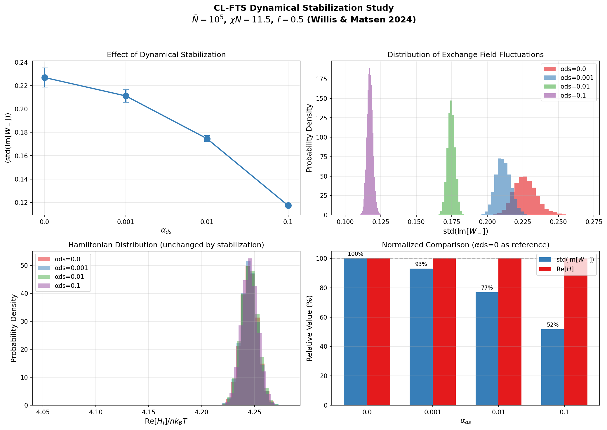

# Dynamical Stabilization for Complex Langevin Field-Theoretic Simulations

## Overview

Complex Langevin field-theoretic simulations (CL-FTS) can suffer from numerical instabilities known as "hot spots" - localized regions where the imaginary part of the exchange field grows uncontrollably. This document describes the dynamical stabilization method implemented in this library, based on Willis & Matsen, *J. Chem. Phys.* **161**, 244903 (2024).

## The Problem: Hot Spots

In CL-FTS, the exchange field $W_-(\mathbf{r})$ is a real-type auxiliary field that develops an imaginary component during the simulation. Without stabilization, $\mathrm{Im}[W_-(\mathbf{r})]$ can exhibit runaway growth at certain grid points ("hot spots"), leading to:

- Numerical instabilities
- Poor sampling of configuration space
- Eventual simulation failure

## The Solution: Dynamical Stabilization

Willis & Matsen proposed adding a stabilization term to the functional derivative of the exchange field:

$$\Lambda_-(\mathbf{r}) = \phi_-(\mathbf{r}) + \frac{2}{\chi N} W_-(\mathbf{r}) + i \alpha_{ds} N \cdot \mathrm{Im}[W_-(\mathbf{r})]$$

where:
- $\alpha_{ds}$ is the stabilization coefficient
- $N$ is the reference polymerization index
- The term $i \alpha_{ds} N \cdot \mathrm{Im}[W_-(\mathbf{r})]$ acts as a restoring force that suppresses imaginary fluctuations

## Usage in This Library

Enable dynamical stabilization by setting the `dynamic_stabilization` parameter:

```python
params = {
    # ... other parameters ...
    "dynamic_stabilization": 0.01,  # αds value
}
```

### Recommended Values

The optimal $\alpha_{ds}$ depends on the invariant polymerization index $\bar{N}$:

| $\bar{N}$ | Recommended $\alpha_{ds}$ | Notes |
|-----------|---------------------------|-------|
| $\geq 10^7$ | 0.001 or less | Minimal stabilization needed |
| $\sim 10^5$ | 0.01 - 0.02 | Good balance of stability and accuracy |
| $\sim 10^4$ | 0.1 or higher | Strong stabilization needed |

**Note:** Higher $\alpha_{ds}$ values provide stronger stabilization but may slightly affect dynamics. For equilibrium properties, the bias is negligible.

## Validation Results

We reproduced the Willis & Matsen results using:
- $\bar{N} = 10^5$ (invariant polymerization index)
- $\chi N = 11.5$
- $f = 0.5$ (symmetric diblock copolymer)
- $32 \times 32 \times 32$ grid
- Discrete chain model

### Results Summary

| $\alpha_{ds}$ | $\mathrm{std}(\mathrm{Im}[W_-])$ | Reduction | $\mathrm{Re}[H]$ |
|---------------|----------------------------------|-----------|------------------|
| 0.0 | $0.227 \pm 0.008$ | — | 4.2450 |
| 0.001 | $0.211 \pm 0.005$ | 7% | 4.2449 |
| 0.01 | $0.175 \pm 0.003$ | 23% | 4.2451 |
| 0.1 | $0.117 \pm 0.002$ | 48% | 4.2455 |

### Key Findings

1. **Effective Stabilization**: Dynamical stabilization significantly reduces $\mathrm{std}(\mathrm{Im}[W_-])$, the standard deviation of the imaginary part of the exchange field.

2. **No Equilibrium Bias**: The Hamiltonian $\mathrm{Re}[H]$ remains unchanged ($\approx 4.245$) across all $\alpha_{ds}$ values, confirming that stabilization does not bias equilibrium properties.

3. **Reduced Variance**: Higher $\alpha_{ds}$ also reduces the variance in $\mathrm{std}(\mathrm{Im}[W_-])$, indicating more stable sampling.



## Implementation Details

The stabilization is applied during the Langevin field update step. For exchange fields (real-type auxiliary fields), the functional derivative is modified:

```python
# In the Langevin update loop
if alpha_ds > 0:
    for i in range(M):
        if i in mpt.aux_fields_real_idx:  # Exchange fields only
            w_lambda[i] += 1j * alpha_ds * np.imag(w_aux[i])
```

The noise structure remains unchanged:
- Real noise for exchange fields ($W_-$)
- Imaginary noise for pressure fields ($W_+$)

## References

1. Willis, J. D. & Matsen, M. W. "Stabilizing complex-Langevin field-theoretic simulations for block copolymer melts." *J. Chem. Phys.* **161**, 244903 (2024). DOI: [10.1063/5.0245363](https://doi.org/10.1063/5.0245363)

2. Matsen, M. W. "Field-Theoretic Simulations for Block Copolymer Melts Using the Partial Saddle-Point Approximation." *Macromolecules* **55**, 497-509 (2022).

## Example Script

See `Lamella.py` in this directory for a complete example with dynamical stabilization enabled.
